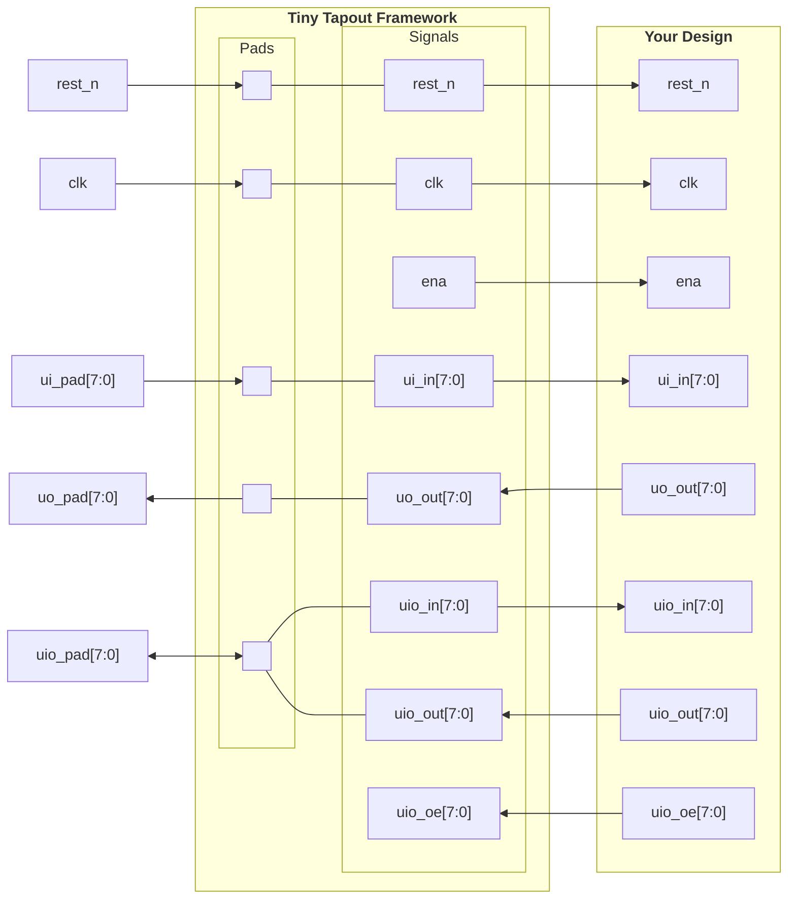
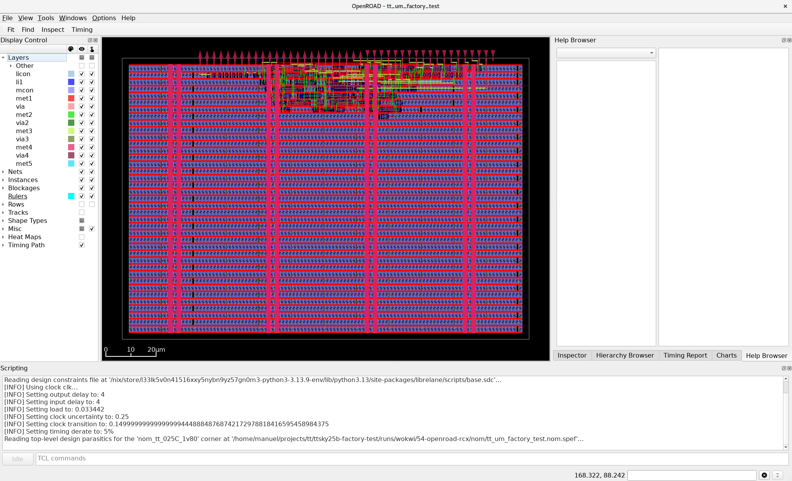
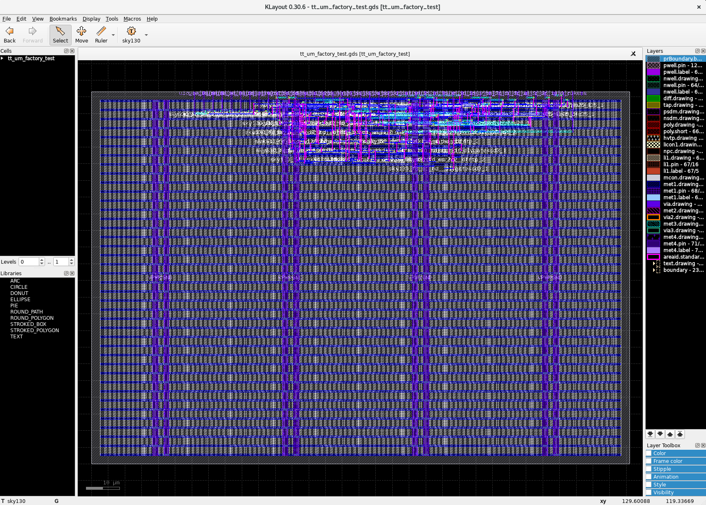

# Working with Tiny Tapeout

## 1. Introduction

[Tiny Tapeout](https://tinytapeout.com/) is a service that allows you to buy small `tiles` within a pre-built framework to fabricate a custom chip with your design at a very low cost. For this purpose, it uses `OpenPDKs` from SkyWaters, GlobalFoundries, and IHP through `ChipIgnite`, `Wafer.Space`, and `IHP`, resepctively.

To get started, follow the instructions in this [link](https://tinytapeout.com/hdl/) to create an HDL project. Watch the YouTube video, it is very helpful. We will use the provided [GF template](https://github.com/TinyTapeout/ttgf-verilog-template) in this tutorial, but you can adapt/modify it to the technology you are working with.


## 2. How to Submit an HDL Project

!!! note
    Here is a [link](https://youtu.be/fCGPKdmM3Dc?si=h22Dx0I146v3MaLY) to a Tiny Tapeout video explaining the processes. 

If you already have a working project, follow this instructions to submit your design.

1. Go to the repository template for your techology. For `GF180MCU`: https://github.com/TinyTapeout/ttgf-verilog-template.
Press the `Use this template` button and create a new repository in your `GitHub` account. Make the repository `Public`.

2. Enable `GitHub Actions`. Follow the instructions in the `README.md` file in the repository.

3. Add the Verilog files under `src`, fill the metadata in the `info.yaml`.

4. Add testbench files under `test`.

5. Add some documentation about your project in `info.md` under `docs`.

6. Every time you push a commit, `GitHub Actions` will run the `hardening` job, which consists of producing a `GDS` and verifying it according to `TT-Setup` (Tiny Tapeout setup), and produce the `documentation` of your design to be included in the chip datasheet.

7. Revise your design until yo uget all three action buttons `green`.

8. With the design passing all actions, go to [app.tinytapeout.com](https://app.tinytapeout.com).

9. Sign in with your `GitHub` account, create a project by indicating the link to your repository, and press `submit`.

10. With your project created, make it part of the tapeout by `submitting a revision`.

11. You can also test the `hardening` process locally by installing some tools and following this example. However, the final run to submit your design will go through `GitHub Actions`.

12. You can continue to make changes by submitting a new revision in the same app until the deadline.


## 3. The Tiny Tapeout Interface

Tiny Tapeout interfaces with your project using a custom interface shown in the table and code below. Code copied from https://github.com/TinyTapeout/ttihp-verilog-template/blob/main/src/project.v.

### Interface Table & Code

=== "Table"

    | User Pads | Tiny Tapeout Framework | Your Design |
    | :-------- | :--------------------- | :---------- |
    | rst_n        | rst_n        | rst_n        |
    | clk          | clk          | clk          |
    |              | ena          | ena          |
    | ui_pad[7:0]  | ui_in[7:0]   | ui_in[7:0]   |
    | uo_pad[7:0]  | uo_out[7:0]  | uo_out[7:0]  |
    | uio_pad[7:0] | uio_in[7:0]  | uio_in[7:0]  |
    |              | uio_out[7:0] | uio_out[7:0] |
    |              | uio_oe[7:0]  | uio_oe[7:0]  |


=== "File: project.v [Link to source above]"

    ```verilog linenums="1"
    /*
    * Copyright (c) 2024 Your Name
    * SPDX-License-Identifier: Apache-2.0
    */

    `default_nettype none

    module tt_um_example (
        input  wire [7:0] ui_in,    // Dedicated inputs
        output wire [7:0] uo_out,   // Dedicated outputs
        input  wire [7:0] uio_in,   // IOs: Input path
        output wire [7:0] uio_out,  // IOs: Output path
        output wire [7:0] uio_oe,   // IOs: Enable path (active high: 0=input, 1=output)
        input  wire       ena,      // always 1 when the design is powered, so you can ignore it
        input  wire       clk,      // clock
        input  wire       rst_n     // reset_n - low to reset
    );

    // All output pins must be assigned. If not used, assign to 0.
    assign uo_out  = ui_in + uio_in;  // Example: ou_out is the sum of ui_in and uio_in
    assign uio_out = 0;
    assign uio_oe  = 0;

    // List all unused inputs to prevent warnings
    wire _unused = &{ena, clk, rst_n, 1'b0};

    endmodule
    ```

### Interface Diagram



## 4. Your Project

### Repository

1\. We have cloned the template repository [here](https://github.com/manuel-monge/tt2606). You can create your own repository by going to the [template repository](https://github.com/TinyTapeout/ttgf-verilog-template), pressing the `Use this template` button, and creating a new repository in your `GitHub` account. Make the repository `Public`.

``` bash
$ cd [your-projects-directory]
$ git clone https://github.com/manuel-monge/tt2606.git
```

2\. Enable `GitHub Actions` by following the instructions in the `README.md` file in the repository.

### Design Files

3\. We will use the design below in this tutorial. Add this Verilog file under `src` and fill the metadata in the `info.yaml`.

=== "tt_top.v"

    ``` verilog
    /*******************************************************************
    Autor: Manuel Monge
    Description:
        Top-level file for a Tiny Tapeout Project.
    Copyright (c) 2026 Manuel Monge
    SPDX-License-Identifier: Apache-2.0
    *******************************************************************/

    `default_nettype none

    module tt_top (
        input  wire [7:0] ui_in,    // Dedicated inputs
        output wire [7:0] uo_out,   // Dedicated outputs
        input  wire [7:0] uio_in,   // IOs: Input path
        output wire [7:0] uio_out,  // IOs: Output path
        output wire [7:0] uio_oe,   // IOs: Enable path (active high: 0=input, 1=output)
        input  wire       ena,      // always 1 when the design is powered, so you can ignore it
        input  wire       clk,      // clock
        input  wire       rst_n     // reset_n - low to reset
    );

        // *****************************************************************
        // BEGIN: Description of your design
        // *****************************************************************
        //inputs
        wire sclk,sen,sdi;
        //outputs
        wire sdo;
        wire [15:0] dout;

        scanchain16 #(.n(16)) scanchain0 (
            .sclk   (sclk),
            .sen    (sen),
            .sdi    (sdi),
            .sdo    (sdo),
            .dout   (dout)
        );

        // Pin Mapping
        assign sclk = clk;
        assign sen = ui_in[0];
        assign sdi = ui_in[1];
        assign sdo = uo_out[0];

        // *****************************************************************
        // END: Description of your design
        // *****************************************************************

        // *****************************************************************
        // BEGIN: Unused inputs and outputs
        // *****************************************************************

        // All output pins must be assigned. If not used, assign to 0.
        assign uo_out[7:1] = 0;
        assign uio_out = 0;
        assign uio_oe  = 0;

        // List all unused inputs to prevent warnings
        wire _unused = &{ena, rst_n, ui_in[7:2], uio_in, 1'b0};

        // *****************************************************************
        // END: Unused inputs and outputs
        // *****************************************************************

    endmodule


    /*******************************************************************
    Autor: Manuel Monge
    Description:
        Generic Scan Chain (Shift Register and 'valid' register).
    Inputs:
        sclk: Scan clock
        sen: enables the parallel load to the second parallel register
        sdi: Scan chain input (MSB First)
    Outputs:
        sdo: Scan chain output
        dout: Parallel data out
    *******************************************************************/

    module scanchain16(sclk,sen,sdi,sdo,dout);
        parameter n=16;//number of bits of the scan chain
        //inputs
        input sclk,sen,sdi;
        //outputs
        output sdo;
        output [n-1:0] dout;

        reg [n-1:0] chain,dout;

        //shift register
        always@(posedge sclk)
            chain<={chain[n-2:0],sdi};

        //Scan chain output
        assign sdo=chain[n-1];

        //Load bits to parallel output
        always@(posedge sclk)
            if(sen)
                dout<=chain;
    endmodule
    ```

=== "info.yaml"

    ``` yaml
    # Tiny Tapeout project information
    project:
      title:        ""      # Project title
      author:       "Manuel Monge"      # Your name
      discord:      "manuelmonge85"      # Your discord username, for communication and automatically assigning you a Tapeout role (optional)
      description:  ""      # One line description of what your project does
      language:     "Verilog" # other examples include SystemVerilog, Amaranth, VHDL, etc
      clock_hz:     50000000  # Clock frequency in Hz (or 0 if not applicable)

      # How many tiles your design occupies? A single tile is about 340x160 uM.
      tiles: "1x1"          # Valid values: 1x1, 1x2, 2x2, 3x2, 4x2, 3x4 or 4x4

      # Your top module name must start with "tt_um_". Make it unique by including your github username:
      top_module:  "tt_top"

      # List your project's source files here.
      # Source files must be in ./src and you must list each source file separately, one per line.
      # Don't forget to also update `PROJECT_SOURCES` in test/Makefile.
      source_files:
        - "tt_top.v"

    # The pinout of your project. Leave unused pins blank. DO NOT delete or add any pins.
    # This section is for the datasheet/website. Use descriptive names (e.g., RX, TX, MOSI, SCL, SEG_A, etc.).
    pinout:
      # Inputs
      ui[0]: "sen"
      ui[1]: "sdi"
      ui[2]: ""
      ui[3]: ""
      ui[4]: ""
      ui[5]: ""
      ui[6]: ""
      ui[7]: ""

      # Outputs
      uo[0]: "sdo"
      uo[1]: ""
      uo[2]: ""
      uo[3]: ""
      uo[4]: ""
      uo[5]: ""
      uo[6]: ""
      uo[7]: ""

      # Bidirectional pins
      uio[0]: ""
      uio[1]: ""
      uio[2]: ""
      uio[3]: ""
      uio[4]: ""
      uio[5]: ""
      uio[6]: ""
      uio[7]: ""

    # Do not change!
    yaml_version: 6
    ```


### Simulation/Testing Files

Tiny Tapeout uses `cocotb` for testing. `Cocotb` allows you to use `Python` to write your testbench and run your simulations.

4\. Add the testbench file shown below under `test`. Notice how your design is instantiated as `dut` (device-under-test). Code taken from [https://github.com/TinyTapeout/ttihp-verilog-template/blob/main/test/tb.v](https://github.com/TinyTapeout/ttihp-verilog-template/blob/main/test/tb.v).

``` verilog title="tb.v [Link to source above]"
`default_nettype none
`timescale 1ns / 1ps

/* This testbench just instantiates the module and makes some convenient wires
   that can be driven / tested by the cocotb test.py.
*/
module tb ();

  // Dump the signals to a FST file. You can view it with gtkwave or surfer.
  initial begin
    $dumpfile("tb.fst");
    $dumpvars(0, tb);
    #1;
  end

  // Wire up the inputs and outputs:
  reg clk;
  reg rst_n;
  reg ena;
  reg [7:0] ui_in;
  reg [7:0] uio_in;
  wire [7:0] uo_out;
  wire [7:0] uio_out;
  wire [7:0] uio_oe;

  tt_top dut (
      .ui_in  (ui_in),    // Dedicated inputs
      .uo_out (uo_out),   // Dedicated outputs
      .uio_in (uio_in),   // IOs: Input path
      .uio_out(uio_out),  // IOs: Output path
      .uio_oe (uio_oe),   // IOs: Enable path (active high: 0=input, 1=output)
      .ena    (ena),      // enable - goes high when design is selected
      .clk    (clk),      // clock
      .rst_n  (rst_n)     // not reset
  );

endmodule
```


### Documentation

5\. Add some documentation about your project in `info.md` under `docs`.


## 5. Setting Up Local Tools

We will use the following guides: [Local Hardening](https://tinytapeout.com/guides/local-hardening/) and [Testing Your Design](https://tinytapeout.com/hdl/testing/) from tiny Tapeout. 

### Requirements

* `Python 3.11` or newer. I am currently using `Pthon 3.12.3`.

``` bash
# Check you python version
$ python3 --version
```

* Updated version of `Docker`. I am currently using `Docker 29.4.3`.

``` bash
# Check you python version
$ dcoker --version
```

* Clone Tiny Tapeout supported tools as specified in the guide above.

``` bash
$ cd [your-project-directory]/tt2606
$ git clone https://github.com/TinyTapeout/tt-support-tools tt
```

### Python Environment and Dependencies
!!! note 
    We have used Python versions `3.11` and `3.12.3` successfully. Version `3.14` didn't work.

Create a virtual environment for Tiny Tapeout tool repository, activate it, and install dependencies.

``` bash
$ mkdir ~/setups/ttsetup
$ python3 -m venv ~/setups/ttsetup/venv
$ source ~/setups/ttsetup/venv/bin/activate
$ cd [your-project-directory]/tt2606/tt
$ pip install -r requirements.txt
```

### Set Up Environment Variables

Set up `PDK_ROOT`, `PDK`, and `LIBRELANE_TAG`.

``` bash
$ cd [your-project-directory]/tt2606
$ vi env-var
```

``` bash title="env-var"
export PDK_ROOT=~/setups/ttsetup/pdk
export PDK=sky130A
export LIBRELANE_TAG=3.0.0rc1
```

Then, source it with:

``` bash
$ source env-var
```

### Install LibreLane

Install `LibreLane` as shown in the TT guide.

``` bash
$ pip install librelane==$LIBRELANE_TAG
```

## 3. Harden Your Project

!!! info
    **Hardening a Project:** For Tiny Tapeout, hardening a project means going from `HDL` to `GDS`. When you call the hardening function, it uses `LibreLane`, inside a `Docker` container, to synthetize, place, and route your `HDL` design.

Generate `LibreLane` configuration file.

``` bash
$ cd ~/projects/tt/factory-test
$ ./tt/tt_tool.py --create-user-config
```

Harden the design.

``` bash
$ ./tt/tt_tool.py --harden
```

View the design in `OpenRoad`.

``` bash
$ ./tt/tt_tool.py --open-in-openroad
```




and in `KLayout`.

``` bash
$ ./tt/tt_tool.py --open-in-klayout
```




## 4. Your Design

We will duplicate the current `factory-test` project and replicate the flow with a `scanchain` as our digital design.

