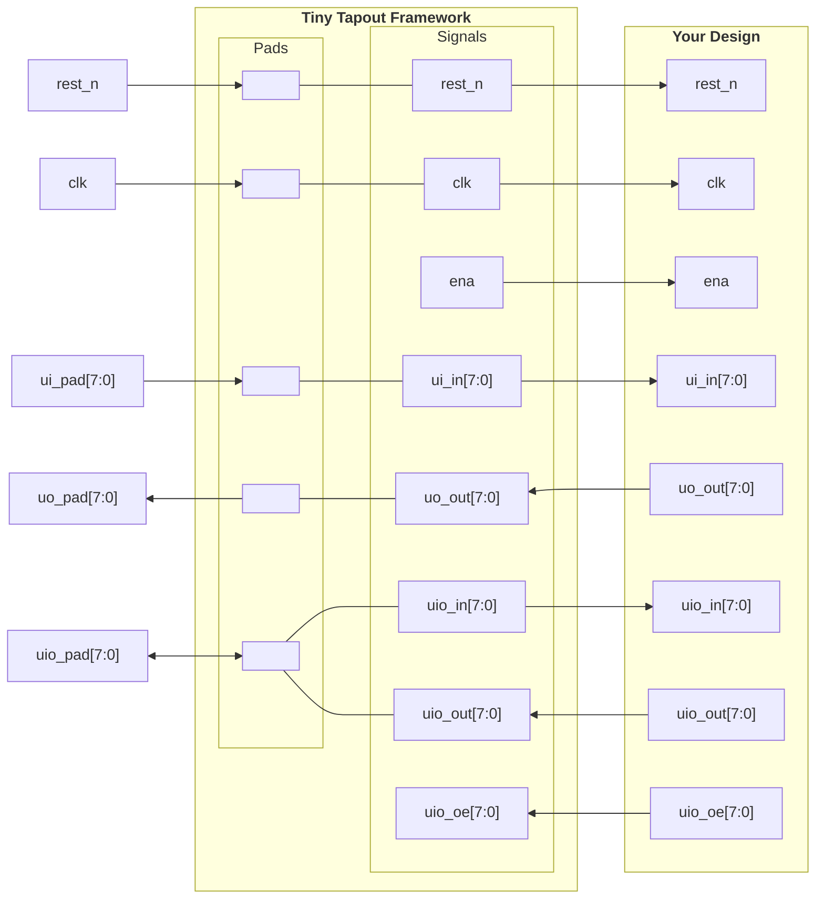

# Working with Tiny Tapeout

## 1. Introduction

[Tiny Tapeout](https://tinytapeout.com/) is a service that allows you to buy small `tiles` within a pre-built framework to fabricate a custom chip with your design at a very low cost. For this purpose, it uses `OpenPDKs` from SkyWaters, GlobalFoundries, and IHP through `ChipIgnite`, `Wafer.Space`, and `IHP`, resepctively.

### How to Get Started

Follow the instructions in this [link](https://tinytapeout.com/hdl/) to create an HDL project. Watch the YouTube video, it is very helpful. We will use the provided [GF template](https://github.com/TinyTapeout/ttgf-verilog-template) in this tutorial, but you can adapt/modify it to the technology you are working with.

### The Tiny Tapeout Interface with Your Project

Tiny Tapeout interfaces with your project using a custom interface shown in the table and code below. Code copied from https://github.com/TinyTapeout/ttihp-verilog-template/blob/main/src/project.v.


=== "Table"

    | User Pads | Tiny Tapeout Framework | Your Design |
    | :-------- | :--------------------- | :---------- |
    | rst_n        | rst_n        | rst_n        |
    | clk          | clk          | clk          |
    |              | ena          | ena          |
    | ui_pad[7:0]  | ui_in[7:0]   | ui_in[7:0]   |
    | uo_pad[7:0]  | uo_out[7:0]  | uo_out[7:0]  |
    | uio_pad[7:0] | uio_in[7:0]  | uio_in[7:0]  |
    |              | uio_out[7:0] | uio_out[7:0] |
    |              | uio_oe[7:0]  | uio_oe[7:0]  |


=== "File: project.v (https://github.com/TinyTapeout/ttihp-verilog-template/blob/main/src/project.v)"

    ```verilog linenums="1"
    /*
    * Copyright (c) 2024 Your Name
    * SPDX-License-Identifier: Apache-2.0
    */

    `default_nettype none

    module tt_um_example (
        input  wire [7:0] ui_in,    // Dedicated inputs
        output wire [7:0] uo_out,   // Dedicated outputs
        input  wire [7:0] uio_in,   // IOs: Input path
        output wire [7:0] uio_out,  // IOs: Output path
        output wire [7:0] uio_oe,   // IOs: Enable path (active high: 0=input, 1=output)
        input  wire       ena,      // always 1 when the design is powered, so you can ignore it
        input  wire       clk,      // clock
        input  wire       rst_n     // reset_n - low to reset
    );

    // All output pins must be assigned. If not used, assign to 0.
    assign uo_out  = ui_in + uio_in;  // Example: ou_out is the sum of ui_in and uio_in
    assign uio_out = 0;
    assign uio_oe  = 0;

    // List all unused inputs to prevent warnings
    wire _unused = &{ena, clk, rst_n, 1'b0};

    endmodule
    ```

### Interface Diagram



## 2. Requirements

We will use the following [guide](https://tinytapeout.com/guides/local-hardening/) from tiny Tapeout. 

* `Python 3.11` or newer.
* Updated version of `Docker`.
* Clone this [repo](https://github.com/TinyTapeout/ttsky25b-factory-test) to `~/projects/tt/factory-test`.
* Clone Tiny Tapeout supported tools as specified in the guide above.

### Python Environment and Dependencies
!!! info 
  I am currently running `Rocky Linux 8.10` which uses `Python 3.6.8`. We have a newer version of Python3 (Python 3.14.0) installed in the system running with `python3.14`. Do not use version 3.14. Use `Python 3.11`.

Create a virtual environment for Tiny Tapeout tool repository, activate it, and install dependencies.

```bash
$ mkdir ~/projects/tt/ttsetup
$ python3.11 -m venv ~/projects/tt/ttsetup/venv
$ source ~/projects/tt/ttsetup/venv/bin/activate
$ cd ~/projects/tt/factory-test/tt
$ pip install -r requirements.txt
```

### Set Up Environment Variables

Set up `PDK_ROOT`, `PDK`, and `LIBRELANE_TAG`.

```bash env-var
export PDK_ROOT=~/projects/tt/ttsetup/pdk
export PDK=sky130A
export LIBRELANE_TAG=3.0.0rc1
```

Then, source it with:

```bash
$ source ~/projects/tt/factory-test/env-var
```

### Install LibreLane

Install `LibreLane` as shown in the TT guide.


## 3. Harden Your Project

!!! info
  Hardening a Project: For Tiny Tapeout, hardening a project means going from `HDL` to `GDS`. When you call the hardening function, it uses `LibreLane`, inside a `Docker` container, to synthetize, place, and route your `HDL` design.

Generate `LibreLane` configuration file.

```bash
$ cd ~/projects/tt/factory-test
$ ./tt/tt_tool.py --create-user-config
```

Harden the design.

```bash
$ ./tt/tt_tool.py --harden
```

View the design in `OpenRoad`.

```bash
$ ./tt/tt_tool.py --open-in-openroad
```


and in `KLayout`.

```bash
$ ./tt/tt_tool.py --open-in-klayout
```


## 4. Your Design

We will duplicate the current `factory-test` project and replicate the flow with a `scanchain` as our digital design.

```verilog title="scanchain16.v"
/*
Autor: Manuel Monge
Description:
	Generic Scan Chain (Shift Register and 'valid' register).
Inputs:
	sclk: Scan clock
	sen: enables the parallel load to the second parallel register
	sdi: Scan chain input
Outputs:
	sdo: Scan chain output
	dout: Parallel data out
*/

module scanchain16(sclk,sen,sdi,sdo,dout);
	parameter n=16;//number of bits of the scan chain
	//inputs
	input sclk,sen,sdi;
	//outputs
	output sdo;
	output [n-1:0] dout;

	reg [n-1:0] chain,dout;

	//shift register
	always@(posedge sclk)
		chain<={sdi,chain[n-1:1]};

	//Scan chain output
	assign sdo=chain[0];

	//Load bits to parallel output
	always@(posedge sclk)
		if(sen)
			dout<=chain;
endmodule
```