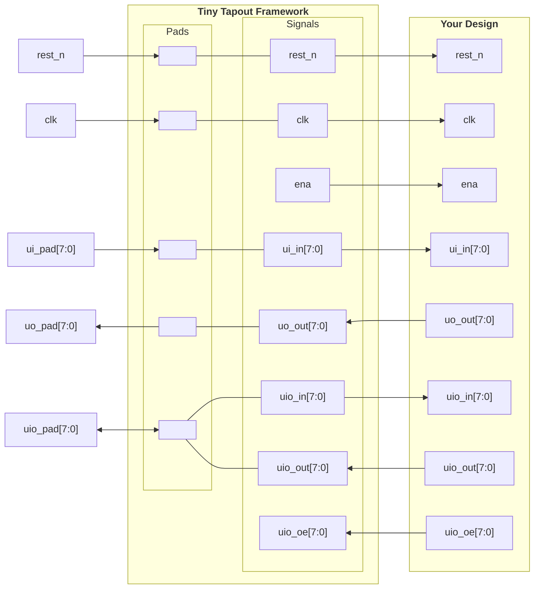

# Working with Tiny Tapeout

## 1. Introduction

[Tiny Tapeout](https://tinytapeout.com/) is a service that allows you to buy small `tiles` within a pre-built framework to fabricate a custom chip with your design at a very low cost. For this purpose, it uses `OpenPDKs` from SkyWaters, GlobalFoundries, and IHP through `Chip Ignite`, `Wafer.Space`, and `IHP`, resepctively.

### How to Get Started

Follow the instructions in this [link](https://tinytapeout.com/hdl/) to create an HDL project. Watch the YouTube video, it is very helpful. We will use the provided [GF template](https://github.com/TinyTapeout/ttgf-verilog-template) in this tutorial, but you can adapt/modify it to the technology you are working with.

### The Tiny Tapeout Interface with Your Project

Tiny Tapeout interfaces with your project using a custom interface shown in the table and code below. Code copied from https://github.com/TinyTapeout/ttihp-verilog-template/blob/main/src/project.v.


| User Pads | Tiny Tapeout Framework | Your Design |
| :-------- | :--------------------- | :---------- |
| rst_n        | rst_n        | rst_n        |
| clk          | clk          | clk          |
|              | ena          | ena          |
| ui_pad[7:0]  | ui_in[7:0]   | ui_in[7:0]   |
| uo_pad[7:0]  | uo_out[7:0]  | uo_out[7:0]  |
| uio_pad[7:0] | uio_in[7:0]  | uio_in[7:0]  |
|              | uio_out[7:0] | uio_out[7:0] |
|              | uio_oe[7:0]  | uio_oe[7:0]  |


```verilog title="project.v from [here](https://github.com/TinyTapeout/ttihp-verilog-template/blob/main/src/project.v)"
/*
 * Copyright (c) 2024 Your Name
 * SPDX-License-Identifier: Apache-2.0
 */

`default_nettype none

module tt_um_example (
    input  wire [7:0] ui_in,    // Dedicated inputs
    output wire [7:0] uo_out,   // Dedicated outputs
    input  wire [7:0] uio_in,   // IOs: Input path
    output wire [7:0] uio_out,  // IOs: Output path
    output wire [7:0] uio_oe,   // IOs: Enable path (active high: 0=input, 1=output)
    input  wire       ena,      // always 1 when the design is powered, so you can ignore it
    input  wire       clk,      // clock
    input  wire       rst_n     // reset_n - low to reset
);

  // All output pins must be assigned. If not used, assign to 0.
  assign uo_out  = ui_in + uio_in;  // Example: ou_out is the sum of ui_in and uio_in
  assign uio_out = 0;
  assign uio_oe  = 0;

  // List all unused inputs to prevent warnings
  wire _unused = &{ena, clk, rst_n, 1'b0};

endmodule
```

### Interface Diagram


