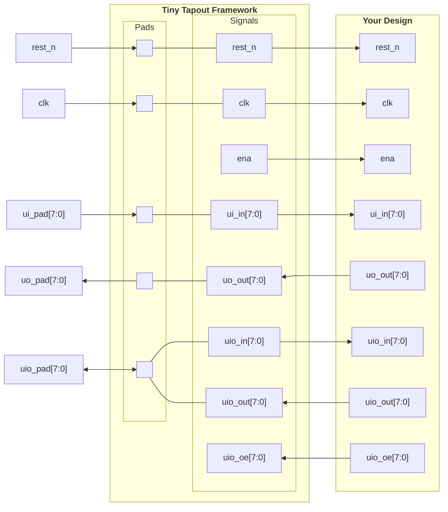
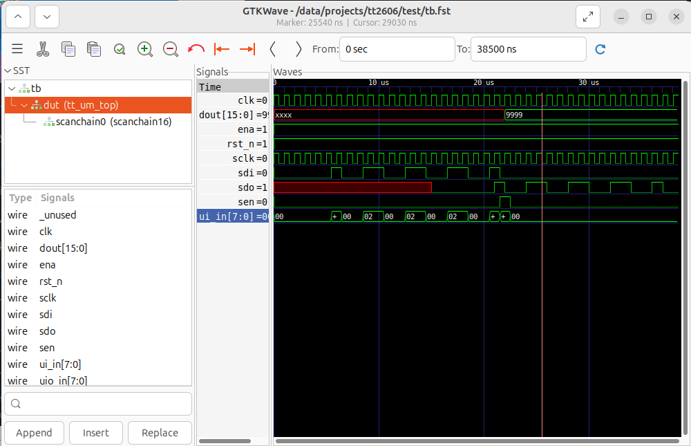
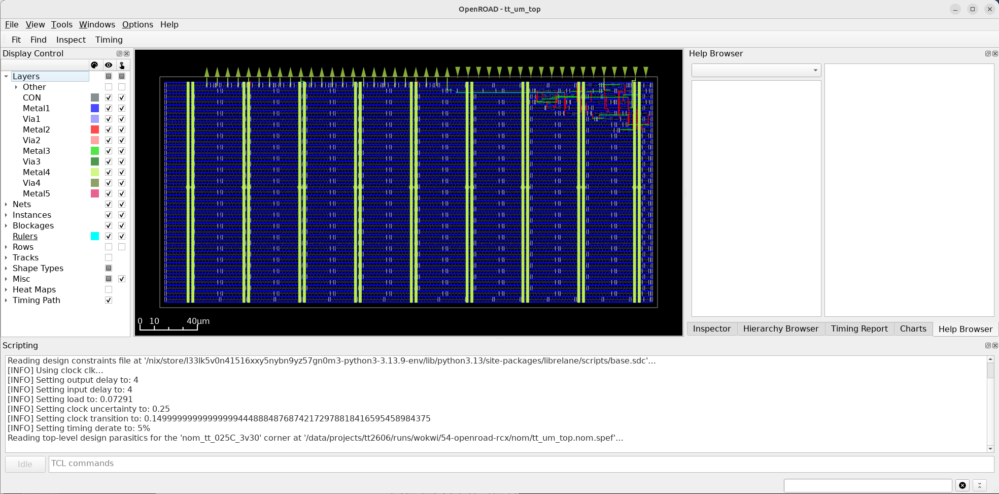
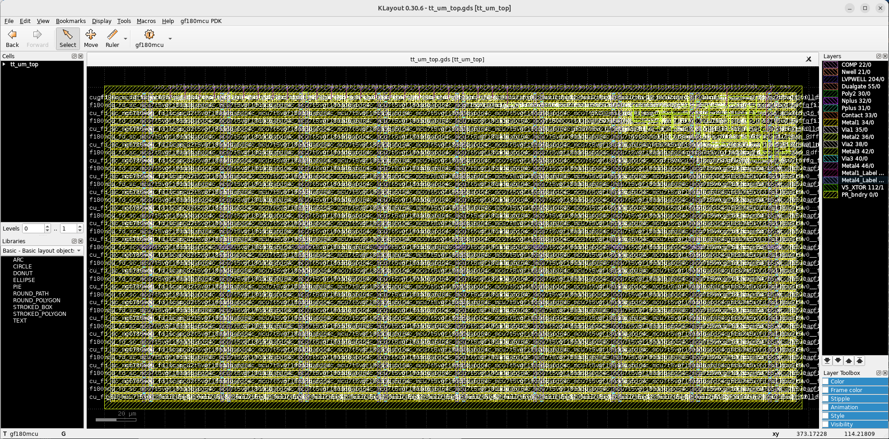

# Working with Tiny Tapeout

## 1. Introduction

[Tiny Tapeout](https://tinytapeout.com/) is a service that allows you to buy small `tiles` within a pre-built framework to fabricate a custom chip with your design at a very low cost. For this purpose, it uses `OpenPDKs` from SkyWaters, GlobalFoundries, and IHP through `ChipIgnite`, `Wafer.Space`, and `IHP`, resepctively.

To get started, follow the instructions in this [link](https://tinytapeout.com/hdl/) to create an HDL project. Watch the YouTube video, it is very helpful. We will use the provided [GF template](https://github.com/TinyTapeout/ttgf-verilog-template) in this tutorial, but you can adapt/modify it to the technology you are working with.


## 2. The Tiny Tapeout Interface

Tiny Tapeout interfaces with your project using a custom interface shown in the table and code below. Code copied from https://github.com/TinyTapeout/ttihp-verilog-template/blob/main/src/project.v.

### 2.1. Interface Table & Code

=== "Table"

    | User Pads | Tiny Tapeout Framework | Your Design |
    | :-------- | :--------------------- | :---------- |
    | rst_n        | rst_n        | rst_n        |
    | clk          | clk          | clk          |
    |              | ena          | ena          |
    | ui_pad[7:0]  | ui_in[7:0]   | ui_in[7:0]   |
    | uo_pad[7:0]  | uo_out[7:0]  | uo_out[7:0]  |
    | uio_pad[7:0] | uio_in[7:0]  | uio_in[7:0]  |
    |              | uio_out[7:0] | uio_out[7:0] |
    |              | uio_oe[7:0]  | uio_oe[7:0]  |


=== "File: project.v [Link to source above]"

    ```verilog linenums="1"
    /*
    * Copyright (c) 2024 Your Name
    * SPDX-License-Identifier: Apache-2.0
    */

    `default_nettype none

    module tt_um_example (
        input  wire [7:0] ui_in,    // Dedicated inputs
        output wire [7:0] uo_out,   // Dedicated outputs
        input  wire [7:0] uio_in,   // IOs: Input path
        output wire [7:0] uio_out,  // IOs: Output path
        output wire [7:0] uio_oe,   // IOs: Enable path (active high: 0=input, 1=output)
        input  wire       ena,      // always 1 when the design is powered, so you can ignore it
        input  wire       clk,      // clock
        input  wire       rst_n     // reset_n - low to reset
    );

    // All output pins must be assigned. If not used, assign to 0.
    assign uo_out  = ui_in + uio_in;  // Example: ou_out is the sum of ui_in and uio_in
    assign uio_out = 0;
    assign uio_oe  = 0;

    // List all unused inputs to prevent warnings
    wire _unused = &{ena, clk, rst_n, 1'b0};

    endmodule
    ```

### 2.2. Interface Diagram


```mermaid
flowchart LR

  s0_p0["rest_n"]
  s0_p1["clk"]
  s0_p3["ui_pad[7:0]"]
  s0_p4["uo_pad[7:0]"]
  s0_p5["uio_pad[7:0]"]

  subgraph s1["`**Tiny Tapout Framework**`"]
    subgraph s10["Pads"]
      s1_p0[" "]
      s1_p1[" "]
      s1_p3[" "]
      s1_p4[" "]
      s1_p5[" "]
      style s1_p0 width:30,x:-15
      style s1_p1 width:30,x:-15
      style s1_p3 width:30,x:-15
      style s1_p4 width:30,x:-15
      style s1_p5 width:30,x:-15
    end
    subgraph s11["Signals"]
      s1_p10["rest_n"]
      s1_p11["clk"]
      s1_p12["ena"]
      s1_p13["ui_in[7:0]"]
      s1_p14["uo_out[7:0]"]
      s1_p15["uio_in[7:0]"]
      s1_p16["uio_out[7:0]"]
      s1_p17["uio_oe[7:0]"]
    end

    s1_p0 --- s1_p10
    s1_p1 --- s1_p11
    s1_p3 --- s1_p13
    s1_p4 --- s1_p14
    s1_p5 --- s1_p15
    s1_p5 --- s1_p16
  end

  subgraph s2["`**Your Design**`"]
    s2_p0["rest_n"]
    s2_p1["clk"]
    s2_p2["ena"]
    s2_p3["ui_in[7:0]"]
    s2_p4["uo_out[7:0]"]
    s2_p5["uio_in[7:0]"]
    s2_p6["uio_out[7:0]"]
    s2_p7["uio_oe[7:0]"]
  end

  s0_p0 --> s1_p0
  s0_p1 --> s1_p1
  s0_p3 --> s1_p3
  s0_p4 ~~~ s1_p4 --> s0_p4
  s1_p4 ~~~ s0_p4

  s0_p5 <--> s1_p5  
  s1_p10 --> s2_p0
  s1_p11 --> s2_p1
  s1_p12 --> s2_p2
  s1_p13 --> s2_p3

  s1_p14 ~~~ s2_p4 --> s1_p14
  s2_p4 ~~~ s1_p14
  
  s1_p15 --> s2_p5
  s1_p16 ~~~ s2_p6 --> s1_p16
  s2_p6 ~~~ s1_p16
  s1_p17 ~~~ s2_p7 --> s1_p17
  s2_p7 ~~~ s1_p17

```

## 3. Example Project

### 3.1. Repository

We have cloned the template repository [here](https://github.com/manuel-monge/tt2606). You can create your own repository by going to the [template repository](https://github.com/TinyTapeout/ttgf-verilog-template), pressing the `Use this template` button, and creating a new repository in your `GitHub` account. Make the repository `Public`.

``` bash
$ cd [your-projects-directory]
$ git clone https://github.com/manuel-monge/tt2606.git
```

Enable `GitHub Actions` by following the instructions in the `README.md` file in the repository.


### 3.2. Design Files

We will use the design below in this tutorial. Add this Verilog file under `src` and fill the metadata in the `info.yaml`.

=== "tt_um_top.v"

    ``` verilog
    /*******************************************************************
    Autor: Manuel Monge
    Description:
        Top-level file for a Tiny Tapeout Project.
    Copyright (c) 2026 Manuel Monge
    SPDX-License-Identifier: Apache-2.0
    *******************************************************************/

    `default_nettype none

    module tt_top (
        input  wire [7:0] ui_in,    // Dedicated inputs
        output wire [7:0] uo_out,   // Dedicated outputs
        input  wire [7:0] uio_in,   // IOs: Input path
        output wire [7:0] uio_out,  // IOs: Output path
        output wire [7:0] uio_oe,   // IOs: Enable path (active high: 0=input, 1=output)
        input  wire       ena,      // always 1 when the design is powered, so you can ignore it
        input  wire       clk,      // clock
        input  wire       rst_n     // reset_n - low to reset
    );

        // *****************************************************************
        // BEGIN: Description of your design
        // *****************************************************************
        //inputs
        wire sclk,sen,sdi;
        //outputs
        wire sdo;
        wire [15:0] dout;

        scanchain16 #(.n(16)) scanchain0 (
            .sclk   (sclk),
            .sen    (sen),
            .sdi    (sdi),
            .sdo    (sdo),
            .dout   (dout)
        );

        // Pin Mapping
        assign sclk = clk;
        assign sen = ui_in[0];
        assign sdi = ui_in[1];
        assign sdo = uo_out[0];

        // *****************************************************************
        // END: Description of your design
        // *****************************************************************

        // *****************************************************************
        // BEGIN: Unused inputs and outputs
        // *****************************************************************

        // All output pins must be assigned. If not used, assign to 0.
        assign uo_out[7:1] = 0;
        assign uio_out = 0;
        assign uio_oe  = 0;

        // List all unused inputs to prevent warnings
        wire _unused = &{ena, rst_n, ui_in[7:2], uio_in, 1'b0};

        // *****************************************************************
        // END: Unused inputs and outputs
        // *****************************************************************

    endmodule


    /*******************************************************************
    Autor: Manuel Monge
    Description:
        Generic Scan Chain (Shift Register and 'valid' register).
    Inputs:
        sclk: Scan clock
        sen: enables the parallel load to the second parallel register
        sdi: Scan chain input (MSB First)
    Outputs:
        sdo: Scan chain output
        dout: Parallel data out
    *******************************************************************/

    module scanchain16(sclk,sen,sdi,sdo,dout);
        parameter n=16;//number of bits of the scan chain
        //inputs
        input sclk,sen,sdi;
        //outputs
        output sdo;
        output [n-1:0] dout;

        reg [n-1:0] chain,dout;

        //shift register
        always@(posedge sclk)
            chain<={chain[n-2:0],sdi};

        //Scan chain output
        assign sdo=chain[n-1];

        //Load bits to parallel output
        always@(posedge sclk)
            if(sen)
                dout<=chain;
    endmodule
    ```

=== "info.yaml"

    ``` yaml
    # Tiny Tapeout project information
    project:
      title:        "RHD2164-MCU-SPI Bridge"   # Project title
      author:       "Manuel Monge"             # Your name
      discord:      "manuelmonge85"            # Your discord username, for communication and automatically assigning you a Tapeout role (optional)
      description:  "Various SPIs"             # One line description of what your project does
      language:     "Verilog" # other examples include SystemVerilog, Amaranth, VHDL, etc
      clock_hz:     50000000  # Clock frequency in Hz (or 0 if not applicable)

      # How many tiles your design occupies? A single tile is about 340x160 uM.
      tiles: "1x1"          # Valid values: 1x1, 1x2, 2x2, 3x2, 4x2, 3x4 or 4x4

      # Your top module name must start with "tt_um_". Make it unique by including your github username:
      top_module:  "tt_um_top"

      # List your project's source files here.
      # Source files must be in ./src and you must list each source file separately, one per line.
      # Don't forget to also update `PROJECT_SOURCES` in test/Makefile.
      source_files:
        - "tt_um_top.v"

    # The pinout of your project. Leave unused pins blank. DO NOT delete or add any pins.
    # This section is for the datasheet/website. Use descriptive names (e.g., RX, TX, MOSI, SCL, SEG_A, etc.).
    pinout:
      # Inputs
      ui[0]: "sen"
      ui[1]: "sdi"
      ui[2]: ""
      ui[3]: ""
      ui[4]: ""
      ui[5]: ""
      ui[6]: ""
      ui[7]: ""

      # Outputs
      uo[0]: "sdo"
      uo[1]: ""
      uo[2]: ""
      uo[3]: ""
      uo[4]: ""
      uo[5]: ""
      uo[6]: ""
      uo[7]: ""

      # Bidirectional pins
      uio[0]: ""
      uio[1]: ""
      uio[2]: ""
      uio[3]: ""
      uio[4]: ""
      uio[5]: ""
      uio[6]: ""
      uio[7]: ""

    # Do not change!
    yaml_version: 6
    ```


### 3.3. Simulation/Testing Files

Tiny Tapeout uses `cocotb` for testing. `Cocotb` allows you to use `Python` to write your testbench and run your simulations.

Add the testbench file shown below under `test`. Notice how your design is instantiated as `dut` (device-under-test). Code taken from [https://github.com/TinyTapeout/ttihp-verilog-template/blob/main/test/tb.v](https://github.com/TinyTapeout/ttihp-verilog-template/blob/main/test/tb.v).

``` verilog title="tb.v [Link to source above]"
`default_nettype none
`timescale 1ns / 1ps

/* This testbench just instantiates the module and makes some convenient wires
   that can be driven / tested by the cocotb test.py.
*/
module tb ();

  // Dump the signals to a FST file. You can view it with gtkwave or surfer.
  initial begin
    $dumpfile("tb.fst");
    $dumpvars(0, tb);
    #1;
  end

  // Wire up the inputs and outputs:
  reg clk;
  reg rst_n;
  reg ena;
  reg [7:0] ui_in;
  reg [7:0] uio_in;
  wire [7:0] uo_out;
  wire [7:0] uio_out;
  wire [7:0] uio_oe;
`ifdef GL_TEST
  wire VPWR = 1'b1;
  wire VGND = 1'b0;
`endif

  // Replace tt_um_example with your module name:
  tt_um_top dut (

      // Include power ports for the Gate Level test:
`ifdef GL_TEST
      .VPWR(VPWR),
      .VGND(VGND),
`endif

      .ui_in  (ui_in),    // Dedicated inputs
      .uo_out (uo_out),   // Dedicated outputs
      .uio_in (uio_in),   // IOs: Input path
      .uio_out(uio_out),  // IOs: Output path
      .uio_oe (uio_oe),   // IOs: Enable path (active high: 0=input, 1=output)
      .ena    (ena),      // enable - goes high when design is selected
      .clk    (clk),      // clock
      .rst_n  (rst_n)     // not reset
  );

endmodule
```


### 3.4. Documentation

Add some documentation about your project in `info.md` under `docs`.


## 4. Setting Up Local Tools

We will use the following guide [Local Hardening](https://tinytapeout.com/guides/local-hardening/). 

### 4.1. Requirements

Install (or verify) that you have the following tools.

* `Python 3.11` or newer. I am currently using `Pthon 3.12.3`.

``` bash
# Check you python version
$ python3 --version
```

* Updated version of `Docker`. I am currently using `Docker 29.5.0`.

``` bash
# Check you python version
$ dcoker --version
```

* Clone Tiny Tapeout supported tools as specified in the guide above.

``` bash
$ cd [your-project-directory]/tt2606
$ git clone https://github.com/TinyTapeout/tt-support-tools tt
```

### 4.2. Python Environment and Dependencies

!!! note 
    We have used Python versions `3.11` and `3.12.3` successfully. Version `3.14` didn't work.

Create a virtual environment for Tiny Tapeout tool repository, activate it, and install dependencies.

``` bash
$ mkdir ~/setups/ttsetup
$ python3 -m venv ~/setups/ttsetup/venv
$ source ~/setups/ttsetup/venv/bin/activate
$ cd [your-project-directory]/tt2606/tt
$ pip install -r requirements.txt
```

### 4.3. Set Up Environment Variables

Set up `PDK_ROOT`, `PDK`, and `LIBRELANE_TAG`.

``` bash
$ cd [your-project-directory]/tt2606
$ vi env-var
```

``` bash title="env-var"
export PDK_ROOT=~/setups/ttsetup/pdk
export PDK=gf180mcuD
export LIBRELANE_TAG=3.0.0rc1
```

Then, source it with:

``` bash
$ source env-var
```

### 4.4. Install LibreLane

Install `LibreLane` as shown in the TT guide.

``` bash
$ pip install librelane==$LIBRELANE_TAG
```


### 4.5. Install Verilog simulation tools

We will install `iverilog`, `verilator`, `GTKWave`, `cocotb`, and `pytest`.

``` bash
$ sudo apt install iverilog verilator
$ sudo apt install gtkwave
$ pip3 install cocotb pytest
```


## 5. Simulating Your Project

We will use the following guides: [Local Hardening](https://tinytapeout.com/guides/local-hardening/) and [Testing Your Design](https://tinytapeout.com/hdl/testing/) from tiny Tapeout. 

### 5.1. Set up your simulation

Add your verilog files to the `Makefile` by updating the list `PROJECT_SOURCES` with, for example:

``` Makefile
PROJECT_SOURCES = top.v module1.v module2.v module3.v
```

For this tutorial, it is only one file.
``` Makefile
PROJECT_SOURCES = tt_um_top.v
```

We will run our testbench using `cocotb`. Create/open `test.py`.

``` python
import cocotb
from cocotb.clock import Clock
from cocotb.triggers import ClockCycles, Timer

# Function to set a specific bit in an array of bits (like ui_in)
def set_bit_in_array(array, index, bit_value):
    # bit_value should be 0 or 1
    aux = array.value
    aux[index] = bit_value
    array.value = aux 

# Test to verify the behavior of the project
@cocotb.test()
async def test_project(dut):
    dut._log.info("Start")

    # Set the clock period to 1 us (1 MHz)
    clkperiod = 1 # in us
    clock = Clock(dut.clk, clkperiod, unit="us")
    cocotb.start_soon(clock.start())

    # Reset
    dut._log.info("Reset")
    dut.ena.value = 1
    dut.ui_in.value = 0
    dut.uio_in.value = 0
    dut.rst_n.value = 0
    await ClockCycles(dut.clk, 1)
    dut.rst_n.value = 1
    await ClockCycles(dut.clk, 5)
    await Timer(0.5*clkperiod, unit="us") # half clock cycle

    dut._log.info("Test project behavior")

    # Set the scanchain inputs for 0x1001100110011001
    din_value = "1001100110011001"
    dut._log.info("din_value: %s", din_value)

    # Shift in the input values bit by bit into the scanchain using SDI and SEN signals.
    dut._log.info("Shift in the data into the scanchain")

    set_bit_in_array(dut.ui_in, 1, 1) # SDI = 1
    await Timer(1*clkperiod, unit="us")
    set_bit_in_array(dut.ui_in, 1, 0) # SDI = 0
    await Timer(1*clkperiod, unit="us")
    set_bit_in_array(dut.ui_in, 1, 0) # SDI = 0
    await Timer(1*clkperiod, unit="us")
    set_bit_in_array(dut.ui_in, 1, 1) # SDI = 1
    await Timer(1*clkperiod, unit="us")
    set_bit_in_array(dut.ui_in, 1, 1) # SDI = 1
    await Timer(1*clkperiod, unit="us")
    set_bit_in_array(dut.ui_in, 1, 0) # SDI = 0
    await Timer(1*clkperiod, unit="us")
    set_bit_in_array(dut.ui_in, 1, 0) # SDI = 0
    await Timer(1*clkperiod, unit="us")
    set_bit_in_array(dut.ui_in, 1, 1) # SDI = 1
    await Timer(1*clkperiod, unit="us")
    set_bit_in_array(dut.ui_in, 1, 1) # SDI = 1
    await Timer(1*clkperiod, unit="us")
    set_bit_in_array(dut.ui_in, 1, 0) # SDI = 0
    await Timer(1*clkperiod, unit="us")
    set_bit_in_array(dut.ui_in, 1, 0) # SDI = 0
    await Timer(1*clkperiod, unit="us")
    set_bit_in_array(dut.ui_in, 1, 1) # SDI = 1
    await Timer(1*clkperiod, unit="us")
    set_bit_in_array(dut.ui_in, 1, 1) # SDI = 1
    await Timer(1*clkperiod, unit="us")
    set_bit_in_array(dut.ui_in, 1, 0) # SDI = 0
    await Timer(1*clkperiod, unit="us")
    set_bit_in_array(dut.ui_in, 1, 0) # SDI = 0
    await Timer(1*clkperiod, unit="us")
    set_bit_in_array(dut.ui_in, 1, 1) # SDI = 1
    await Timer(1*clkperiod, unit="us")
    dut.ui_in.value = "00000001" # SDI = 0; SEN = 1
    await Timer(1*clkperiod, unit="us")
    set_bit_in_array(dut.ui_in, 0, 0) # SEN = 0


    obj = getattr(dut.dut, 'dout', None) # Check for dut-internal variable "dout" (which is the case for RTL simulation but not for GL simulation)
    
    if obj == None:
        sim_is_rtl = 0
        dut._log.info("GL simulation detected")
    else:
        sim_is_rtl = 1
        dut._log.info("RTL simulation detected")


    if sim_is_rtl:
        # Assert if the parallel output of the scanchain is correct after shifting in the input values.
        dout_value = str(dut.dut.dout.value) # Get the dut.sdo value in binary string format
        dut._log.info("dout_value: %s", dout_value)
        assert dout_value == din_value # Check if the parallel output matches the input value.
    

    # continue with test by scanning out all bits
    await Timer(16*clkperiod, unit="us")

    # Verify the last value of SDO after scanning out all bits is Zero.
    aux = str(dut.uo_out.value) # Get the output value in binary string format
    sdo_last = int(aux[0]) # Get the last value of SDO
    dut._log.info("sdo_last: %d", sdo_last)

    assert sdo_last == 0 # Check if the last value of SDO is 0.
```


### 5.2. Running the RTL simulation

To run the RTL simulation, execute:

``` bash
make -B
```

You should see in your terminal an output similar to this.

``` bash
$ make -B
rm -f results.xml
"make" -f Makefile results.xml
make[1]: Entering directory '/data/projects/tt2606/test'
mkdir -p sim_build/rtl
/usr/bin/iverilog -o sim_build/rtl/sim.vvp -s tb -g2012 -I/data/projects/tt2606/test/../src -f sim_build/rtl/cmds.f  /data/projects/tt2606/test/../src/tt_um_top.v /data/projects/tt2606/test/tb.v
rm -f results.xml
COCOTB_TEST_MODULES=test COCOTB_TESTCASE= COCOTB_TEST_FILTER= COCOTB_TOPLEVEL=tb TOPLEVEL_LANG=verilog \
         /usr/bin/vvp -M /home/manuel/setups/ttsetup/venv/lib/python3.12/site-packages/cocotb/libs -m libcocotbvpi_icarus   sim_build/rtl/sim.vvp -fst   
     -.--ns INFO     gpi                                ..mbed/gpi_embed.cpp:93   in _embed_init_python              Using Python 3.12.4 interpreter at /home/manuel/setups/ttsetup/venv/bin/python3
     -.--ns INFO     gpi                                ../gpi/GpiCommon.cpp:79   in gpi_print_registered_impl       VPI registered
     0.00ns INFO     cocotb                             Running on Icarus Verilog version 12.0 (stable)
     0.00ns INFO     cocotb                             Seeding Python random module with 1779493212
     0.00ns INFO     cocotb                             Initialized cocotb v2.0.1 from /home/manuel/setups/ttsetup/venv/lib/python3.12/site-packages/cocotb
     0.00ns INFO     cocotb                             Running tests
     0.00ns INFO     cocotb.regression                  running test.test_project (1/1)
     0.00ns INFO     cocotb.tb                          Start
     0.00ns INFO     cocotb.tb                          Reset
FST info: dumpfile tb.fst opened for output.
  5500.00ns INFO     cocotb.tb                          Test project behavior
  5500.00ns INFO     cocotb.tb                          din_value: 1001100110011001
  5500.00ns INFO     cocotb.tb                          Shift in the data into the scanchain
 22500.00ns INFO     cocotb.tb                          RTL simulation detected
 22500.00ns INFO     cocotb.tb                          dout_value: 1001100110011001
 38500.00ns INFO     cocotb.tb                          sdo_last: 0
 38500.00ns INFO     cocotb.regression                  test.test_project passed
 38500.00ns INFO     cocotb.regression                  **************************************************************************************
                                                        ** TEST                          STATUS  SIM TIME (ns)  REAL TIME (s)  RATIO (ns/s) **
                                                        **************************************************************************************
                                                        ** test.test_project              PASS       38500.00           0.00   12403464.47  **
                                                        **************************************************************************************
                                                        ** TESTS=1 PASS=1 FAIL=0 SKIP=0              38500.00           0.00    8707506.28  **
                                                        **************************************************************************************
                                                        
make[1]: Leaving directory '/data/projects/tt2606/test'
```

You can see your simulation waveforms by running `GTKWave`. If you run it in the background, you can have a persistent `GUI` with your waveforms while you modigy your testbench.

``` bash
$ gtkwave tb.fst &
```

Here is an image of the simulation results.



To save your current `GTKWave` wave configuration, you can save it to a `gtkw` file using the `GUI`. You can reopen your results by executing:

``` bash
$ gtkwave tb.fst tb.gtkw &
```


### 5.3. Running the Gate-Level simulation

!!! warning
    You first need to `harden` your project to run a `gate-level` simulation.

Copy your gate-level netlist to your test folder. Execute the following:

``` bash
$ cd [your-project-directory]/tt2606/test
$ TOP_MODULE=$(cd .. && ./tt/tt_tool.py --print-top-module)
$ cp ../runs/wokwi/final/pnl/$TOP_MODULE.pnl.v gate_level_netlist.v
```

Run the gate-level simulation executing:

``` bash
$ make -B GATES=yes
```
You should see in your terminal an output similar to this.

``` bash
make -B GATES=yes
rm -f results.xml
"make" -f Makefile results.xml
make[1]: Entering directory '/data/projects/tt2606/test'
mkdir -p sim_build/gl
/usr/bin/iverilog -o sim_build/gl/sim.vvp -s tb -g2012 -DGL_TEST -DFUNCTIONAL -DUSE_POWER_PINS -DSIM -DUNIT_DELAY=#1 -I/data/projects/tt2606/test/../src -f sim_build/gl/cmds.f  /home/manuel/setups/ttsetup/pdk/ciel/gf180mcu/versions/54435919abffb937387ec956209f9cf5fd2dfbee/gf180mcuD/libs.ref/gf180mcu_fd_sc_mcu7t5v0/verilog/primitives.v /home/manuel/setups/ttsetup/pdk/ciel/gf180mcu/versions/54435919abffb937387ec956209f9cf5fd2dfbee/gf180mcuD/libs.ref/gf180mcu_fd_sc_mcu7t5v0/verilog/gf180mcu_fd_sc_mcu7t5v0.v /data/projects/tt2606/test/gate_level_netlist.v /data/projects/tt2606/test/tb.v
rm -f results.xml
COCOTB_TEST_MODULES=test COCOTB_TESTCASE= COCOTB_TEST_FILTER= COCOTB_TOPLEVEL=tb TOPLEVEL_LANG=verilog \
         /usr/bin/vvp -M /home/manuel/setups/ttsetup/venv/lib/python3.12/site-packages/cocotb/libs -m libcocotbvpi_icarus   sim_build/gl/sim.vvp -fst   
     -.--ns INFO     gpi                                ..mbed/gpi_embed.cpp:93   in _embed_init_python              Using Python 3.12.4 interpreter at /home/manuel/setups/ttsetup/venv/bin/python3
     -.--ns INFO     gpi                                ../gpi/GpiCommon.cpp:79   in gpi_print_registered_impl       VPI registered
     0.00ns INFO     cocotb                             Running on Icarus Verilog version 12.0 (stable)
     0.00ns INFO     cocotb                             Seeding Python random module with 1779493356
     0.00ns INFO     cocotb                             Initialized cocotb v2.0.1 from /home/manuel/setups/ttsetup/venv/lib/python3.12/site-packages/cocotb
     0.00ns INFO     cocotb                             Running tests
     0.00ns INFO     cocotb.regression                  running test.test_project (1/1)
     0.00ns INFO     cocotb.tb                          Start
     0.00ns INFO     cocotb.tb                          Reset
FST info: dumpfile tb.fst opened for output.
  5500.00ns INFO     cocotb.tb                          Test project behavior
  5500.00ns INFO     cocotb.tb                          din_value: 1001100110011001
  5500.00ns INFO     cocotb.tb                          Shift in the data into the scanchain
 22500.00ns INFO     cocotb.tb                          GL simulation detected
 38500.00ns INFO     cocotb.tb                          sdo_last: 0
 38500.00ns INFO     cocotb.regression                  test.test_project passed
 38500.00ns INFO     cocotb.regression                  **************************************************************************************
                                                        ** TEST                          STATUS  SIM TIME (ns)  REAL TIME (s)  RATIO (ns/s) **
                                                        **************************************************************************************
                                                        ** test.test_project              PASS       38500.00           0.01    3462576.21  **
                                                        **************************************************************************************
                                                        ** TESTS=1 PASS=1 FAIL=0 SKIP=0              38500.00           0.01    3100508.89  **
                                                        **************************************************************************************
                                                        
make[1]: Leaving directory '/data/projects/tt2606/test'
```


## 6. Harden Your Project

!!! info
    **Hardening a Project:** For Tiny Tapeout, hardening a project means going from `HDL` to `GDS`. When you call the hardening function, it uses `LibreLane`, inside a `Docker` container, to synthetize, place, and route your `HDL` design.

Generate `LibreLane` configuration file.

``` bash
$ cd [your-project-directory]/tt2606
$ ./tt/tt_tool.py --create-user-config --gf
```

Harden the design.

``` bash
$ ./tt/tt_tool.py --harden --gf
```

Check for any possible warnings.

``` bash
$ ./tt/tt_tool.py --print-warnings --gf
```

View the design in `OpenRoad`.

``` bash
$ ./tt/tt_tool.py --open-in-openroad --gf
```



and in `KLayout`.

``` bash
$ ./tt/tt_tool.py --open-in-klayout
```




